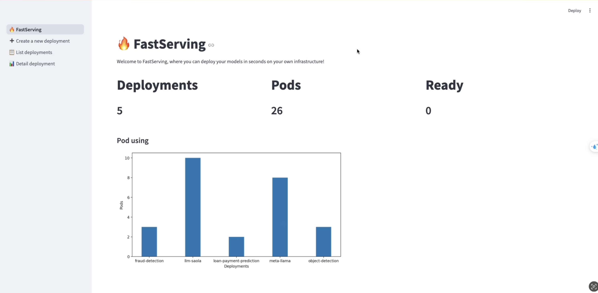
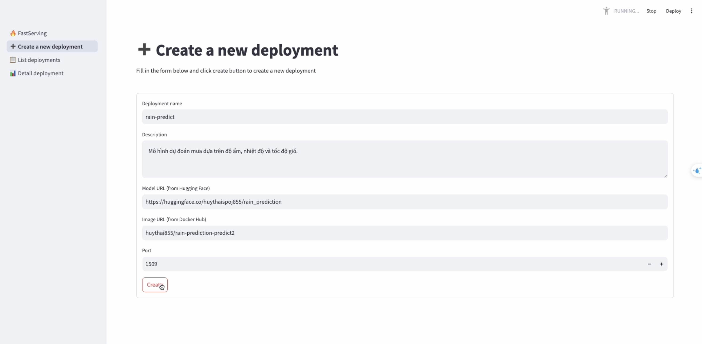
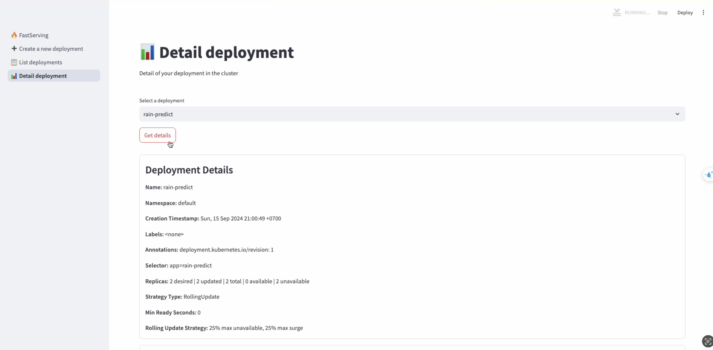
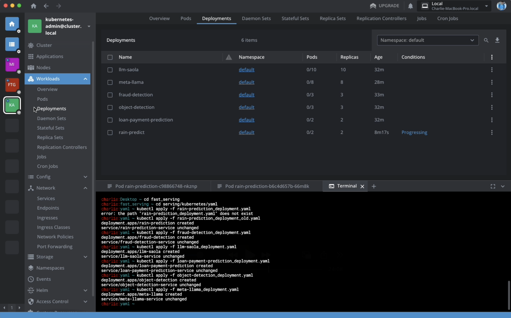

# FastServing - A simple and comprehensive Machine Learning Model Deployment System

In today's world, with the rapid growth of artificial intelligence, businesses are increasingly seeking to apply AI models. Leading cloud providers such as Google Cloud, Amazon Web Services, and Microsoft Azure offer comprehensive platforms for deploying machine learning models, namely Google Vertex AI, AWS SageMaker, and Azure ML. However, it can be challenging for businesses to deploy their models on these platforms due to concerns about sending sensitive user and business data overseas or to a specific cloud provider.

So, we're introducing FastServing - a simple and comprehensive system for deploying machine learning models, allowing businesses to easily deploy AI models on their own infrastructure. Key advantages of FastServing:
- Deploy machine learning models on your Kubernetes cluster in just a few minutes.
- Keep all data entirely within your own infrastructure, with no need to share it elsewhere.
- Open-source, allowing businesses to use with no platform risk.
- User-friendly interface, easy to use even for beginners.
<br/>

## Project structure
```
(root)
    │
    ├── /build
    │   ├── Dockerfile
    │   ├── predict.py
    │   ├── rain_prediction.joblib
    │   └── requirements.txt
    │
    │
    ├── /frontend
    │   ├── /.streamlit/pages.toml        
    │   ├── main.py
    │   └── /pages
    │       ├── dashboard.py
    │       ├── create.py
    │       ├── detail.py
    │       └── list.py
    │
    │
    ├── /serving
    │   ├── app.py
    │   ├── config.py
    │   ├── requirements.txt
    │   │
    │   ├── /models
    │   │   └── deployment.py
    │   │
    │   ├── /controllers
    │   │   └── deployment_controller.py
    │   │
    │   └── /kubernetes
    │       ├── /yaml
    │       │   ├── rain_predict_deployment.yaml
    │       │   └── template.yaml
    │       ├── create_deployment.py
    │       ├── get_deployment_detail.py
    │       ├── get_deployment_list.py
    │       └── .kubeconfig
    │
    │
    ├── README.md
    └── .gitignore
```
<br/>

## Demo
- **Homepage of the system**: Users can see key indicators of the system: number of deployments, using pods and ready pods.
     

- **Create a new deployment**: Users can create a new deployment by filling in the form with information of model url, image url and port to expose.
    

- **View deployment details**: Users can view details of a deployment running on the Kubernetes.
    

- **Deployments in Lens**: At the same time, users can see all deployments running on the Kubernetes via Lens to make sure that everything is working correctly.
    
<br/>

## Future work
- Add **Logging** & **Monitoring** features.
- Add **Test deployment** feature directly on the interface.
- Add features to support the CI/CD process.
- Support more sources for image and model other than DockerHub and HuggingFace.
- Support customization of deployment attributes such as replicas, arguments, and startup commands, etc.
- Support the entire lifecycle of the MLOps process, visually managing the ML pipeline.
- Add **Model catalog** feature to help users easily select current SOTA models to deploy.
<br/>

____
For any issues related to the product or collaboration, please send an email to [nguyenhuythai15@gmail.com](mailto:nguyenhuythai15@gmail.com).